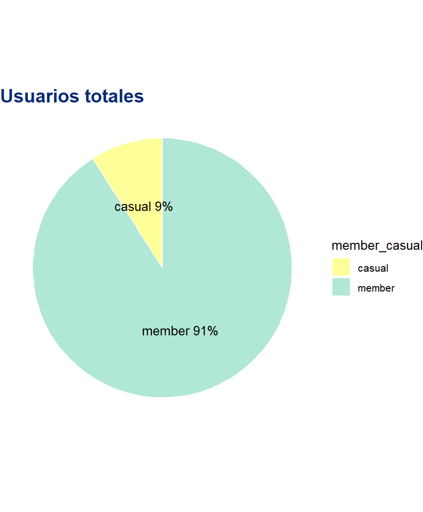

# Google-data-analyst-proyect---Cyclistic-bike-share
##
##
##
## este codigo bla bla
```sql
SELECT * FROM ventas
WHERE fecha >= '2025-01-01';
```
En este proyecto se analizaron los datos del caso de estudio Cyclistic Bike-Share en RStudio para identificar diferencias entre usuarios casuales y miembros. Se realizaron tareas de limpieza, unificación de datos, creación de variables y visualizaciones que permitieron generar recomendaciones estratégicas para aumentar membresías y su rentabilidad.

